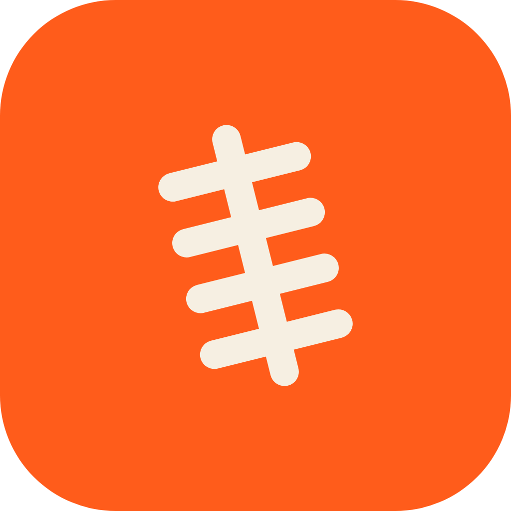

# COMMISH

**Your Survivor pool, out of that one guy's Venmo.**

Buy-ins escrowed on-chain. Picks locked at kickoff. Last one standing takes the pot.

[commish.fun](https://commish.fun) · Built on Solana · NFL Survivor pools

---

## The problem

Every NFL Survivor pool works the same way: ten to a hundred people send their buy-in to one guy's Venmo, and then everyone trusts that guy for eighteen weeks. He holds the pot. He tracks the picks. He decides disputes. He pays out, eventually, if nothing goes wrong. Pools move thousands of dollars a season this way, secured by nothing but friendship.

Commish keeps the commissioner and removes the custody.

## How it works

1. **Create a pool.** Set the buy-in (USDC) and share a join link.
2. **Join.** Each member pays the buy-in into an on-chain escrow vault that no individual can touch, the commissioner included.
3. **Pick weekly.** One NFL team to win, each week. Picks lock at the week's first kickoff and are recorded on-chain, so nobody can claim on Monday that they definitely picked the Bills.
4. **Survive.** Your team wins, you advance. Loses or ties, you're out. Each team usable once per season.
5. **Get paid.** Last member standing takes the pot, automatically. No chasing, no "I'll get to it."

## The trust model, honestly

Weekly results enter through the commissioner's confirmation, checked against public NFL scores. There is no oracle pretense. What the chain removes is every way commissioner trust historically fails:

| The commissioner cannot... | Because... |
|---|---|
| Spend the pot | The vault only moves through payout logic |
| Change the rules mid-season | Rules are fixed at pool creation |
| Slow-pay the winner | Settlement is a permissionless crank anyone can fire |
| Quietly post fake results | A dispute window lets members veto results anyone can verify on any scoreboard |
| Strand the money | A deadman switch lets members reclaim their share if the pool is ever abandoned |

The commissioner keeps the job, loses the custody.

## Architecture

- **On-chain:** a small Anchor program. A pool PDA owns the USDC vault; member PDAs track picks, used teams, and elimination; instructions cover join, pick, post-results, veto, settle, claim, and the deadman refund.
- **Server:** a thin sync layer that proposes weekly results from public NFL scores for the commissioner to confirm.
- **App:** pool creation, join links, the pick grid, and live pool status.

## Status

🏗️ **Building in public, Sept 3–10, 2026** as an entry in [NoahAI Nitro 03](https://x.com/TryNoahAI) (theme: build the Solana version of your favorite Web2 product). Ships for NFL Week 1 kickoff.

- [x] Escrow program: create / join / vault
- [x] Pick submission with on-chain lock
- [x] Results: post, dispute window, member veto
- [x] Weekly settlement + eliminations
- [x] Payouts: winner, co-winner split, deadman refund
- [x] Pick grid + pool dashboard
- [ ] First real pool onboarded

**What that has actually been put through**, because a checked box is only worth
its evidence:

- One pool ran the whole loop on **devnet against production timing** — 4h14m,
  with `post_results` refused for three hours after the lock and
  `finalize_week` refused for an hour after that, every boundary enforced by
  the chain. Vault $3.00 → $0.00, the single survivor paid exactly $3.00.
- The **deadman refund** has been driven end to end: a pool abandoned, three
  members each taking their pro-rata share back, vault to zero.
- A **veto** has struck a posting down by majority and been re-posted, and a
  minority vote has correctly failed to strike one down.
- **19 LiteSVM tests pass against the production binary** — `anchor build` with
  no features, the one that would actually ship. `tests/00-build-guard.ts`
  refuses to run the suite against anything else, because a `fastclock` build
  shortens the very floors those tests exist to check.

Not yet: an audit, mainnet, a multisig upgrade authority, and the four league
instructions, which are tested but have no UI.

## Brand

Action `#FF6A2B` (the brand, links and buttons) · Night `#0A100C` · Turf `#16281C` (exported artwork only) · Cream `#F0F2EC` · Pot Gold `#E9C258` (money only) · Alive `#57E08A` · Out `#EC565B`

Mark: the laces, nothing else. Orange on night and never on a filled tile *in
the product* — orange is the interaction colour, and an orange slab at the top
of a page teaches people it means nothing. The filled tile is for frames
somebody else owns: the avatar, app icon and favicon are cream laces on orange,
because at 48px in a timeline and 16px in a tab strip, night on dark
disappears. Whole kit generated from one set of numbers by
[`scripts/build-brand.mjs`](scripts/build-brand.mjs); assets in [`brand/`](brand/).

## Disclaimer

Commish is escrow infrastructure for private pools among people who know each other. Nothing here is financial, gambling, or legal advice. Know the rules that apply where you live before running a pool.

---

**Week 1 locks Thursday.** 🏈

